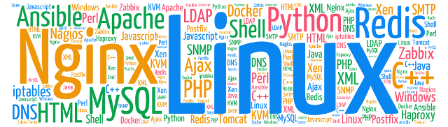

# Vincent VAN HOLLEBEKE

> vincent@compuscene.org 
> +33 6 52 06 65 84

> 50 rue du marais 
> 60600 Breuil Le Vert 
> France

> Sex: Male 
> Date of birth : 11 April 1979 
> Marital status: Single

## Objective

**Looking for a DevOps position that brings everyday new technical challenges.**

## Summary

More than 10 years of experience, with strong analytical skills and a broad range of computer expertise

Versatile and adaptable to many situations, can easily switch from system administration to software development

Determinated, passionate, hard working individual with unyielding self motivate

Tenacious problem solver, able to quickly grasp complex systems and identify opportunities for improvements and resolution of critical issues

Very good teamwork and leardship skills

## Work experiences

### May 2015 to now : Site Reliability Engineer at Criteo (Advertising, Paris)

As member of the SRE - Storage team, my mission is to provide services for applications which require high performance, high availability and scalable databases.

**Key technologies**

* Couchbase
* Cassandra
* ElasticSearch
* RabbitMQ

### March 2013 to April 2015 : Senior System Administrator at Pretty Simple (video games, Paris)

My primary mission was to define the architecture of production environment and make it evolve according to the volume of users and new features developed by technical teams.

**Some numbers :**

* 3 games including Criminal Case (Facebook Game of year 2013)
* 100 millions Criminal Case players in the world, including 10 millions daily active users
* 150 servers located in the United States in datacenters (Seattle, San Jose, Dallas)

**Used technologies:**

* Ubuntu Linux operating system
* Nginx web server with PHP-FPM
* MySQL database in master/slave replication mode
* Redis key-value datastore
* High availability with HaProxy/Keepalived
* Amazon CloudFront CDN
* Zabbix/Collectd/Facette monitoring
* Automation based on Ansible

This environment must be up everyday, 24h/24, so I was regularly on call.

Moreover, building the infrastructure was not possible without the help of dev teams. That's why I was often involved working with them.

**Moving the company headquarters**

From January 2014 to December 2014, I also had to design and make the implementation of the local network for the new offices. It consisted of:

* Server room implantation
* Copper and optical wiring across the whole building (13 floors)
* Network devices installation and configuration (Cisco C6509 chassis, 3750 switch)
* VOIP based on Asterisk IPBX

### November 2012 to March 2013 : System and Networks Manager at Skyrock (blog platform, Paris)

**Everyday**

* Lead a 4 people team
* Make the link between my team and the executive management
* Plan and Coordinate activities
* Define needs and budgets
* Anticipate platform growth and provide solutions

**2012 : Merging datacenters project**

This project conducted under my direction was to merge the 2 existent datacenters in one. The main objectives were to reduce room rental costs and rationalize the infrastructure. The key achievements were:

* Select and manage providers: quotes, orders and job tracking
* Make the inventory of the existing
* Conceive and deploy a new network architecture
* Define the implantation plan
* Physically move servers

### December 2011 to November 2012 : System and Networks Administrator at Skyrock (blog platform, Paris)

**Everyday**

* Install and configure production servers: 900 Debian GNU/Linux servers spread in 2 datacenters
* Manage MySQL databases (100 servers), with high availability and large volumes problematics
* Administer the Neolane solution which have to send 1 million emails to users everyday
* Deploy in production new releases
* On call (1 week per month)
* Write technical documentation

**Collaborating with the BI team**

* Deployed, scheduled and debugged ETL jobs
* Written a specific task scheduler allowing jobs dependencies, error management, bug tracking and better supervision.
* Deployed Tableau server to make BI reports available for the whole company
* Designed and deployed the architecture of the social recommendation engine (KXEN)

### January 2007 to December 2011 : System Administrator at AFT-IFTIM (transport & logistics training, Creil - France)

**Everyday**

* Install and configure production servers: 150 Windows/Linux servers
* Manage virtualized environments (VMWare ESXI)
* Lotus Notes/Domino administration (1500 mailboxes)
* BlackBerry BES administration
* Release management
* Level 2 & 3 technical support
* Write technical documentation

**Projects**

* Performed a complete overhaul of the Lotus Notes environment: set up a Lotus Domino cluster for high availability, improved security and converged to best practices.
* Deployed the Nagios/Centreon/Nagvis monitoring solution (500 devices, 5000 services)
* Implemented the mail platform for trainers (Debian, Postfix, SpamAssassin, ClamAV, Amavis)

### May 2003 to January 2007 : Software Developer at AFT-IFTIM (transport & logistics training, Creil - France)

Designed and developed the internal business applications, in a C++ / DB2 / Lotus Notes environment

* Programmed from scratch the application which collects training tax credit for apprentices
* Pushed on Internet the calendar to allow interns self-registration
* Set up SEO on institutional website
* Level 2 technical support
* Written technical documentation

## Education

* **2002 :** Master in computer science at the University of Amiens, France
* **2000 :** DUT (two-years university degree in technology) at the university of Amiens, France
* **1997 :** Baccalauréat (French secondary school diploma), science major
